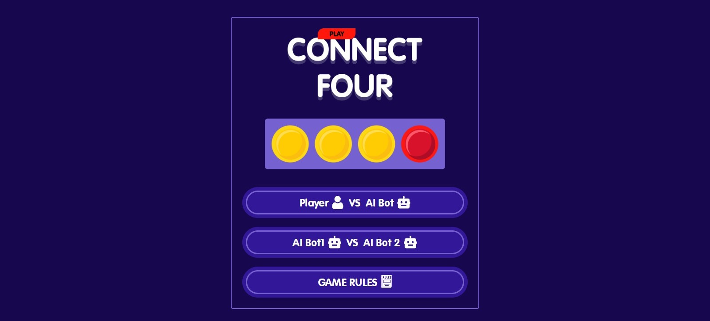
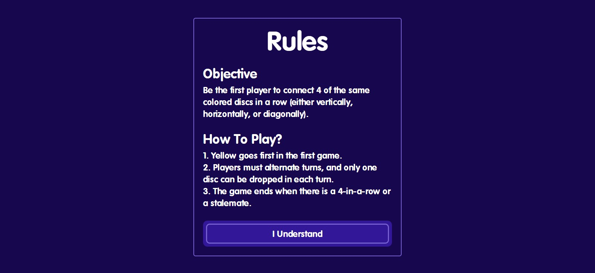
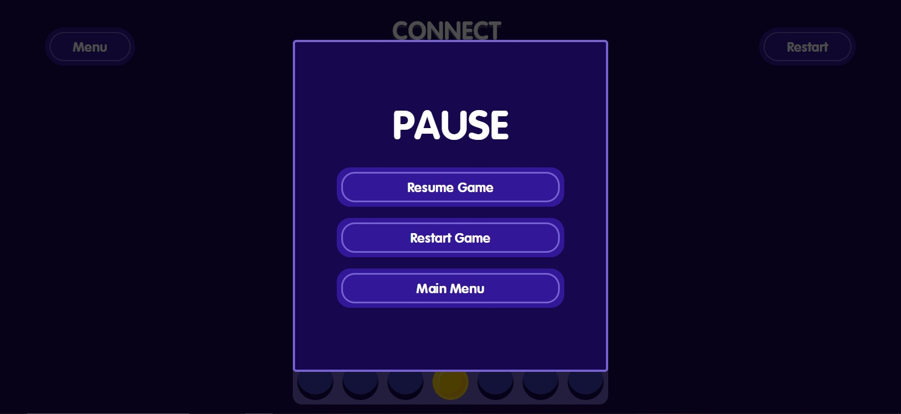
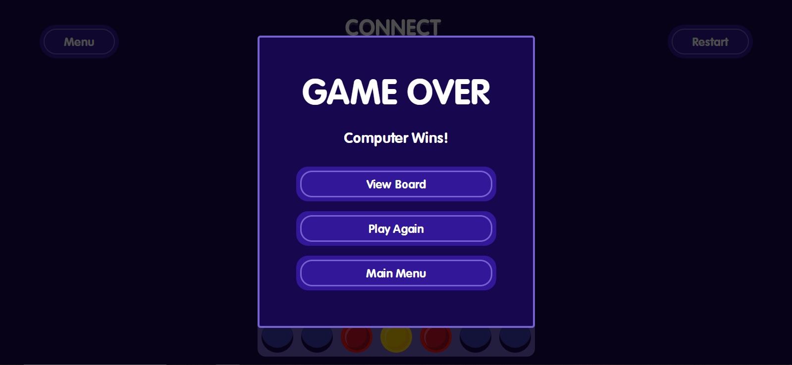
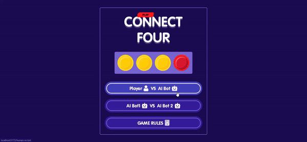
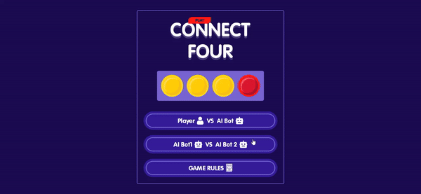

# Connect4 Game

Connect Four is a classic two-player connection game in which the players first choose a color and then take turns dropping one of their colored discs from the top into a vertically suspended grid. The grid is typically 6 rows by 7 columns. The objective of the game is to connect four of one's own discs of the same color in a row, horizontally, vertically, or diagonally, before the opponent.



In this project, you will find a 4-connect game implementation with player vs bot and bot vs bot functionality. The backend is built using Flask, and the frontend is developed using React. The game employs the Minimax algorithm with alpha-beta pruning and incorporates heuristics for optimal decision-making.

## Features

- Player vs Bot gameplay
- Bot vs Bot simulation
- Minimax algorithm with alpha-beta pruning
- Heuristic evaluation for efficient decision-making

## User Interface


### Main Menu


### Game Rules


### Menu Popup


### Game Over Popup


# Player vs Bot


# Bot vs Bot



## How to Run

### Backend (Flask)

1. Navigate to the `backend` directory.
   
   ```bash
   cd backend
   ```
   
3. Install the requirements.
   
   ```bash
   pip install -r requirements.txt
   ```
   
4. Run the Flask application.
   
   ```bash
   flask run
   ```

   
### Frontend (React)

1. Navigate to the `frontend` directory (the root directory).
   
2. Install the dependencies.
   ```bash
   npm install
   ```
   
3. Run the `frontend`.
   ```bash
   npm run dev
   ```


## Contributing

Contributions are always welcome! If you find a bug or have a feature request, please open an issue. If you want to contribute code, please follow these steps:

1. Fork the repository
2. Create a new branch: `git checkout -b my-feature`
3. Make your changes and commit them: `git commit -am 'Add some feature'`
4. Push to the branch: `git push origin my-feature`
5. Submit a pull request


## Tools Used

This project was created using the following tools:

-  React
-  JavaScript
-  Tailwind CSS
-  npm
-  ESLint
-  Git
-  Prettier
-  Visual Studio Code
-  Python
-  Flask
-  Socket

---

<p align="center">
  Made with ❤️ by Fellah Wassim
</p>
